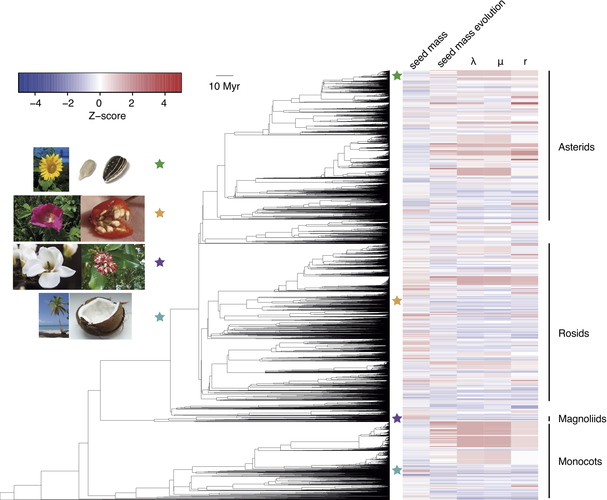

Seed size and diversification
=============================

R code for the manuscript "Seed size and its rate of evolution correlate with species diversification across angiosperms" by Javier Igea, Eleanor F. Miller, Alexander S.T. Papadopulos and Andrew J. Tanentzap. [biorxiv] (http://dx.doi.org/10.1101/053116)

This repository contains all the scripts required to perform the analyses and generate crude versions of the plots in the manuscript. 

**analysis.R** prepares and performs all the analyses using the scripts stored in **./R/** folder.

Note that BAMM analyses are to be performed separately. BAMM results files should be copied to the **./raw_data/BAMM_results/** folder.
Also please note that some steps take a considerable amount of time to run; these are marked with a warning comment throughout the repository

